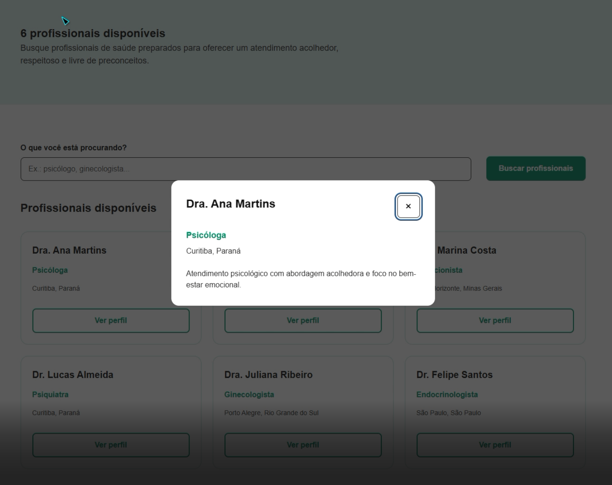
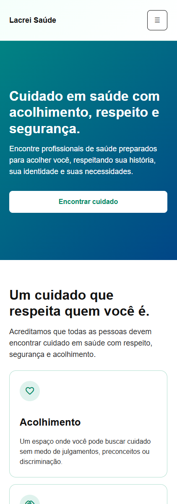
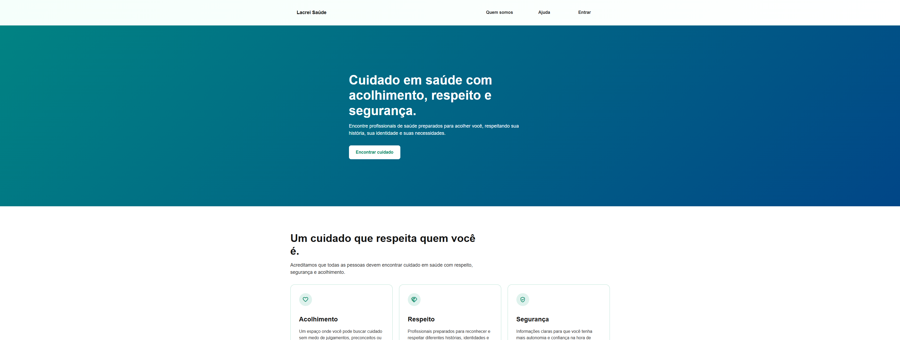
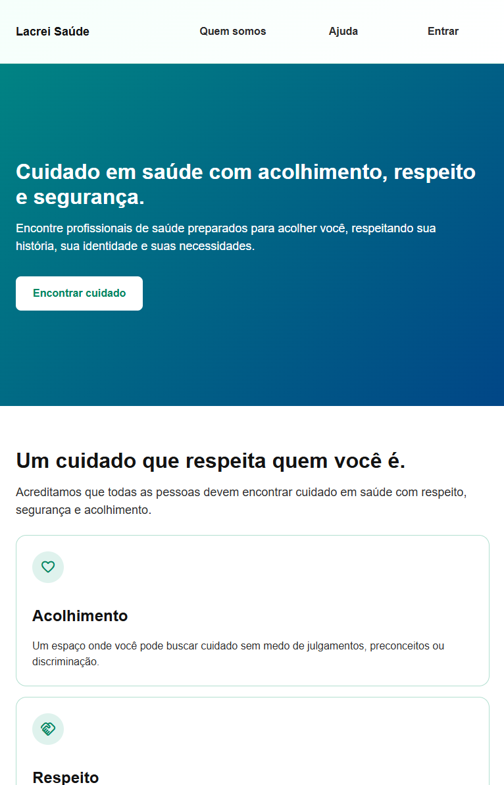
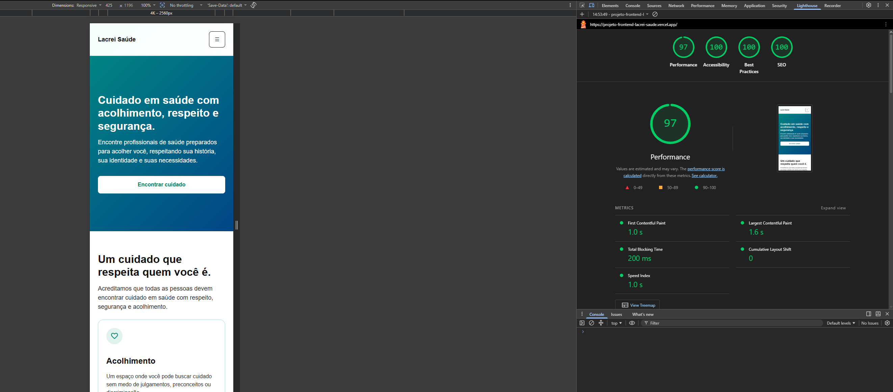
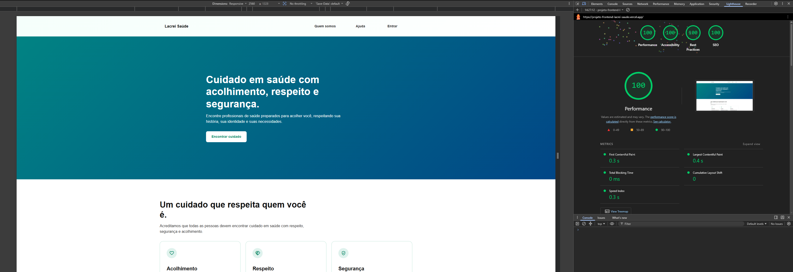

# Lacrei Saúde — Frontend

Aplicação frontend desenvolvida como desafio técnico, com foco em **acessibilidade, responsividade, experiência do usuário e fidelidade ao Marsha Design System**.

O projeto simula uma plataforma para busca de profissionais de saúde preparados para oferecer um atendimento acolhedor, respeitoso e seguro.

## Demonstração

**Aplicação publicada:** https://projeto-frontend-lacrei-saude.vercel.app

### Rotas

* `/` — página inicial
* `/buscar` — busca de profissionais

A aplicação foi validada tanto localmente quanto no ambiente publicado.

## 🛠️ Tecnologias

* Next.js 16.3.4
* React 19.2.8
* TypeScript
* styled-components 6.5.3
* Vitest 2.1.9
* Testing Library
* ESLint
* Vercel
* GitHub Actions

## 📋 Funcionalidades

### Página inicial

A página apresenta:

* proposta da plataforma;
* informações sobre acolhimento, respeito e segurança;
* chamada para busca de profissionais;
* navegação para as principais áreas da aplicação.

### Busca de profissionais

A página `/buscar` permite:

* visualizar profissionais disponíveis;
* pesquisar por nome;
* pesquisar por especialidade;
* pesquisar por localização;
* visualizar mensagem quando não existem resultados;
* abrir o perfil de um profissional;
* fechar o perfil pelo botão de fechamento;
* fechar o modal utilizando `Escape`.

### Estados da aplicação

Foram implementados estados específicos para:

* **Loading:** `Carregando profissionais...`
* **Sucesso:** exibição dos profissionais encontrados;
* **Vazio:** mensagem quando nenhum profissional corresponde à busca;
* **Erro:** mensagem informando que os profissionais não puderam ser carregados.

Os dados são mockados para representar uma futura integração com API.

## Elementos interativos

Os principais elementos interativos utilizados no fluxo são:

### Encontrar profissionais

Direciona o usuário para a página de busca.

### Ver perfil

Abre um modal contendo as informações do profissional selecionado.

### Fechar

Fecha o modal do profissional.

Além desses controles, a aplicação possui navegação, campo de busca e controles de menu responsivos.

## 🎨 Marsha Design System

A interface foi desenvolvida seguindo as referências fornecidas do **Marsha Design System**, priorizando consistência visual, hierarquia de conteúdo e acessibilidade.

### Cores

Foram utilizados tokens centralizados para manter consistência entre os componentes.

Principais grupos:

* Emerald
* Green
* Gray
* Red
* Orange
* Blue

Também foram utilizados os gradientes definidos para o projeto:

* **Primary:** `#018383 → #014687`
* **Subtle:** `#F5FFFB → #FFFFFF`
* **Secondary:** `#008392 → #00BC86`

Os tokens foram organizados em categorias semânticas:

* `background`
* `text`
* `border`
* `icon`

Isso permite utilizar o significado da cor em vez de depender diretamente de valores hexadecimais nos componentes.

### Tipografia

A hierarquia tipográfica foi organizada para diferenciar:

* títulos;
* subtítulos;
* corpo de texto;
* textos auxiliares;
* elementos de formulário.

A aplicação prioriza contraste e legibilidade em diferentes tamanhos de tela.

### Espaçamento

Foram seguidas as referências de espaçamento do Marsha Design System.

#### Desktop

* Header → elemento: `48px`
* Footer → elemento: `64px`
* Heading com underline → subtitle: `8px`
* Heading com underline → outro elemento: `24px`
* Heading sem underline → subtitle: `16px`
* Heading sem underline → outro elemento: `32px`
* Parágrafo → parágrafo: `16px`
* Texto → controles: `32px`
* Cards: `24px`

#### Mobile

* Heading → underline: `8px`
* Heading → subtitle: `16px`
* Heading → outro elemento: `24px`
* Parágrafo → parágrafo: `16px`
* Texto → controles: `24px`
* Cards: `16px`

### Componentes

A interface foi estruturada utilizando componentes reutilizáveis, incluindo:

* Header
* Footer
* cards de profissionais
* modal de profissional
* elementos de formulário
* botões
* ícones

Os ícones utilizam **Material Symbols**, mantendo peso visual consistente.

## ♿ Acessibilidade

A acessibilidade foi tratada como parte da implementação e não apenas como uma validação posterior.

Foram utilizados:

* HTML semântico;
* hierarquia correta de headings;
* labels associados aos controles;
* atributos ARIA quando necessários;
* `role="alert"` para mensagens de erro;
* foco visível;
* navegação por teclado;
* fechamento do modal com `Escape`;
* controles acessíveis por leitores de tela;
* textos alternativos quando aplicáveis.

### Navegação por teclado

O fluxo foi validado utilizando teclado:

* `Tab` para avançar entre elementos;
* `Shift + Tab` para retornar;
* `Enter` para ativar controles;
* `Escape` para fechar o modal;
* foco visual nos elementos interativos.

### Teste com NVDA

O fluxo de busca e abertura do perfil foi validado utilizando o leitor de tela **NVDA**.

Durante o teste:

* o nome do profissional foi anunciado;
* a descrição do profissional foi anunciada;
* o controle de fechamento do modal foi identificado como **"Fechar, botão"**.

O teste também foi registrado em vídeo como evidência.

[](./docs/acessibilidade/nvda-modal.mp4)

*Clique na imagem para assistir ao vídeo do teste.*


## Responsividade

A interface foi desenvolvida com abordagem **mobile-first** e validada nos seguintes formatos:

* Mobile  
  
* Desktop  
  
* Tablet  
  
 
A adaptação contempla:

* Header responsivo;
* navegação;
* cards;
* formulário de busca;
* modal;
* espaçamentos;
* organização do conteúdo.

As evidências visuais estão disponíveis no diretório:

```text
docs/
└── responsive/
    ├── mobile.png
    ├── tablet.png
    └── desktop.png
```

## 🔎 Lighthouse

A aplicação foi avaliada utilizando Lighthouse.

### Mobile

| Métrica        | Resultado |
| -------------- | --------: |
| Performance    |    **97** |
| Accessibility  |   **100** |
| Best Practices |   **100** |
| SEO            |   **100** |



### Desktop

| Métrica        | Resultado |
| -------------- | --------: |
| Performance    |   **100** |
| Accessibility  |   **100** |
| Best Practices |   **100** |
| SEO            |   **100** |



As evidências estão disponíveis em:

```text
docs/
└── lighthouse/
    ├── mobile.png
    └── desktop.png
```

## 🧪 Testes

O projeto utiliza **Vitest** e **Testing Library**.

No estado atual:

```text
Test Files: 4 passed
Tests:      15 passed
```

Os testes cobrem:

* carregamento dos profissionais;
* listagem;
* busca por nome;
* busca por especialidade;
* busca por localização;
* ausência de resultados;
* limpeza da busca;
* abertura do modal;
* fechamento do modal;
* fechamento com `Escape`;
* estado de erro;
* Header;
* Footer;
* ProfessionalModal.

### Cobertura

| Métrica    |  Cobertura |
| ---------- | ---------: |
| Statements | **64.14%** |
| Branches   | **91.45%** |
| Functions  | **84.37%** |
| Lines      | **64.14%** |

A cobertura global inclui arquivos de configuração e infraestrutura que não possuem comportamento diretamente testável, enquanto os principais fluxos de interface possuem cobertura elevada.

## ⚙️ CI — GitHub Actions

O projeto possui um workflow de CI executado para alterações na branch principal e Pull Requests.

O pipeline executa:

1. Checkout do repositório;
2. configuração do Node.js 22;
3. instalação das dependências com `npm ci`;
4. lint;
5. testes;
6. build de produção.

Comandos utilizados pelo pipeline:

```bash
npm ci
npm run lint
npm test -- --run
npm run build
```

O workflow foi executado com sucesso no GitHub Actions.

## 🧠 Decisões técnicas

### Next.js

Utilizado para estruturar a aplicação React, organizar as rotas e permitir uma estrutura adequada para uma aplicação frontend moderna.

### React

Utilizado para construção de componentes reutilizáveis e gerenciamento dos estados da interface.

### TypeScript

Utilizado para tipagem estática, principalmente nos dados dos profissionais, propriedades dos componentes e integração com o tema.

### styled-components

Escolhido para manter os estilos próximos aos componentes e permitir a utilização dos tokens do Design System através do `ThemeProvider`.

### Dados mockados

Os profissionais são fornecidos através de dados locais.

A camada de serviço foi mantida separada da página para representar uma futura integração com API sem acoplar a interface diretamente à origem dos dados.

### Vitest + Testing Library

Utilizados para testar o comportamento da interface a partir da perspectiva do usuário, incluindo interações e estados da aplicação.

## ⚠️ Limitações conhecidas

Este projeto é uma implementação frontend para fins de desafio técnico.

Atualmente:

* os profissionais são dados mockados;
* não existe backend próprio;
* não existe autenticação real;
* não existe persistência de dados;
* a busca não consulta uma API externa;
* os estados de loading e erro simulam o comportamento esperado de uma integração futura.

Essas decisões mantêm o escopo do desafio concentrado na experiência frontend, acessibilidade e qualidade da interface.

## 🔄 Rollback

O deploy é realizado através da Vercel.

Cada alteração publicada gera uma nova versão do projeto, permitindo retornar para uma implantação anterior através do histórico de deployments da plataforma.

Em caso de regressão:

1. identificar a versão estável anterior;
2. selecionar o deployment correspondente;
3. promover a versão anterior;
4. corrigir o problema em uma nova alteração;
5. executar novamente o CI antes de uma nova publicação.

## Executando localmente

### Pré-requisitos

* Node.js 22 ou compatível;
* npm;
* Git.

### Instalação

Clone o projeto:

```bash
git clone (https://github.com/BigodeMarine/projeto-frontend-lacrei-saude.git)
```

Entre no diretório:

```bash
cd projeto-frontend-lacrei-saude
```

Instale as dependências:

```bash
npm install
```

Execute em desenvolvimento:

```bash
npm run dev
```

A aplicação estará disponível em:

```text
http://localhost:3000
```

### Testes

Executar os testes:

```bash
npm test
```

Executar uma vez:

```bash
npm test -- --run
```

### Lint

```bash
npm run lint
```

### Build

```bash
npm run build
```

## 📁 Estrutura principal

```text
src/
├── app/
│   ├── buscar/
│   │   ├── page.tsx
│   │   ├── page.styles.ts
│   │   └── page.test.tsx
│   ├── layout.tsx
│   ├── page.tsx
│   └── page.styles.ts
│
├── components/
│   ├── Footer/
│   ├── Header/
│   └── ProfessionalModal/
│    
│
├── data/
│   └── professionals.json
│
├── services/
│   └── professionals.ts
│
├── styles/
│   ├── colors.ts
│   ├── theme.ts
│   ├── styled.d.ts
│   └── ...
│   
└── test/
    └── render.tsx

docs/
├── accessibility/
│   └── nvda-modal.mp4
├── lighthouse/
│   ├── Mobile.png
│   └── Desktop.png
└── responsive/
    ├── Mobile.png
    ├── Tablet.png
    └── Desktop.png
```

## 📌 Status

Projeto concluído com:

* ✅ Interface responsiva
* ✅ Marsha Design System
* ✅ Acessibilidade
* ✅ Testes automatizados
* ✅ Cobertura de testes
* ✅ Lighthouse
* ✅ Teste com NVDA
* ✅ Estados de loading, sucesso, vazio e erro
* ✅ CI com GitHub Actions
* ✅ Build de produção
* ✅ Deploy na Vercel
